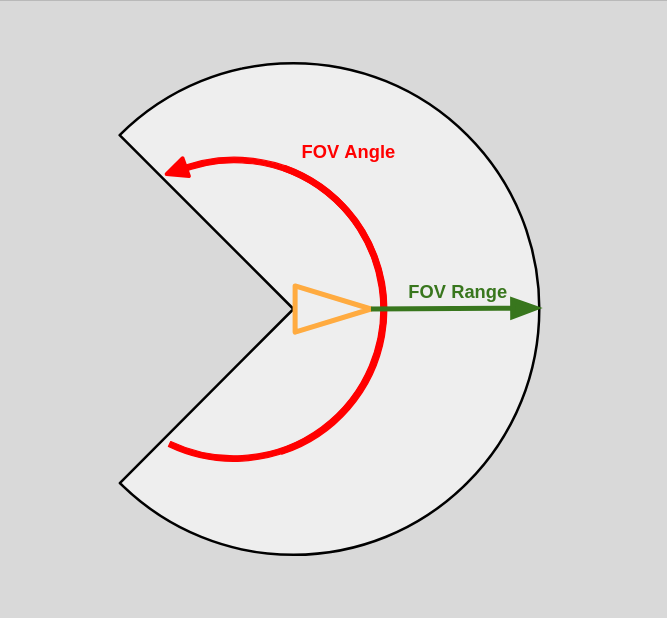
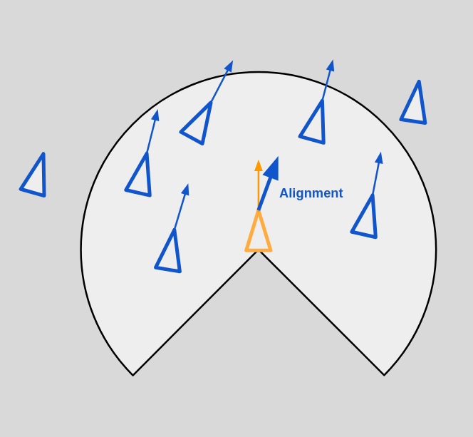
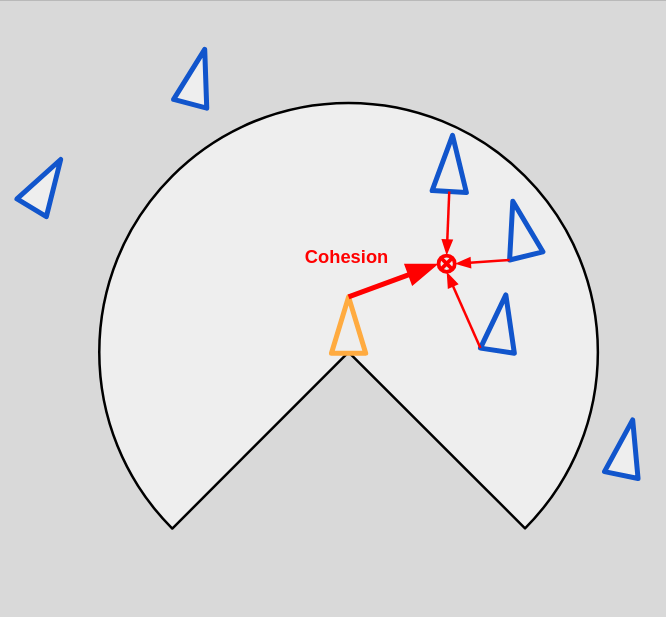
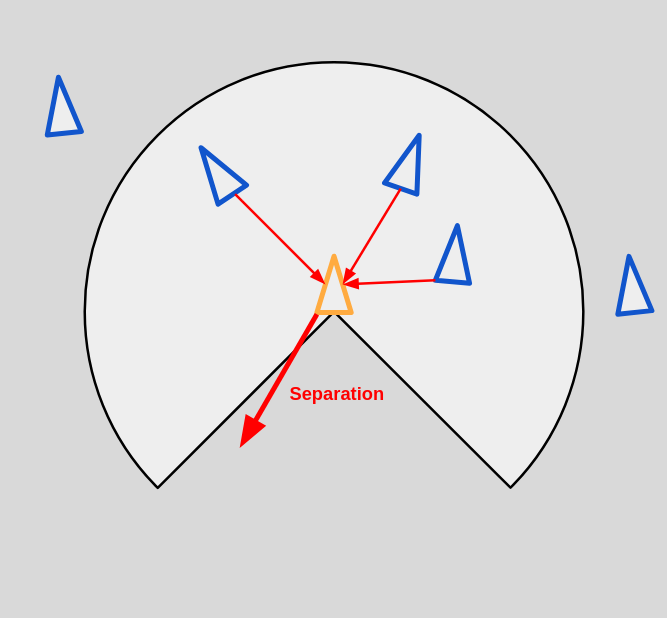
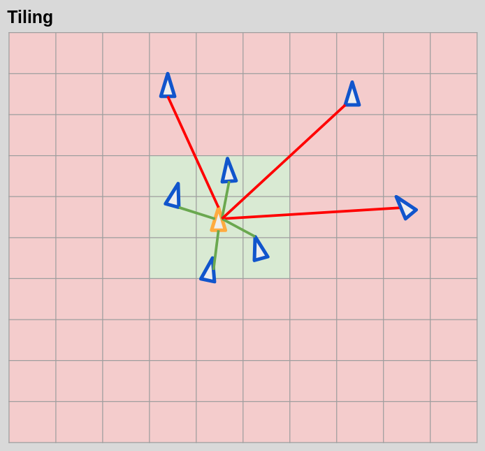
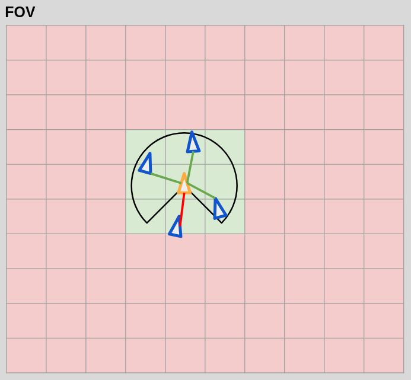
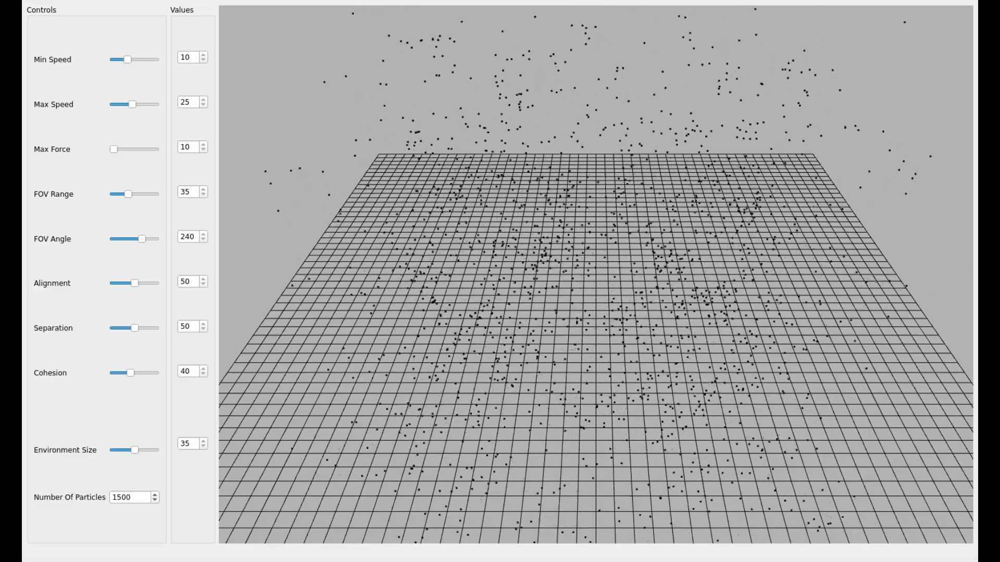

#  Boid Particle System

## Project Goals & Final Result

- For this project, I wanted to create a fully functional Boid System simulation in C++, with a UI that would allow the user to control the different values that affect the simulation. To achieve this, I looked at several articles and references (see [annotated bibliography](#annotated-bibliography)).

- See final result: https://youtu.be/3SO8hEguYWQ

## Program Structure & Implementation

### Structure:

  - **images/** (folder with images for README.md)
    
  - **include/** (folder with all '**.h**' header files):
    
      - ```Bird.h``` → Defines flocking behavior, movement, and perception in 3D space
    
      - ```BoidSystem.h``` → Manages birds, spatial partitioning (tiling), and flocking behavior with adjustable parameters

      - ```MainWindow.h``` → Integrates Qt UI with NGLScene for the simulation controls

      - ```NGLScene.h``` →  Manages BoidSystem simulation, input, rendering, and real-time UI controls
     
      - ```WindowParams.h``` → Stores mouse input states and window size for controlling viewport's rotation, translation, and zoom

    
  - **shaders/** (folder with GLSL shaders used by NGL):

      - ```ParticleFragment.glsl``` → Colours each pixel with the input RGB, making it fully opaque
    
      - ```ParticleVertex.glsl``` → Transforms vertex positions by MVP matrix and passes vertex color to the fragment shader
  
  - **src/** (folder with all '**.cpp**' source files):

      - ```Bird.cpp``` → Defines bird steering behaviors including alignment, cohesion, separation, boundary avoidance, and velocity updates
    
      - ```BoidSystem.cpp``` → Manages bird flock simulation using spatial grid partitioning (tiling), neighbor detection, and real-time parameter control
    
      - ```MainWindow.cpp``` → Creates the main GUI window connecting sliders and controls to the simulation's parameters
    
      - ```NGLScene.cpp``` → Manages OpenGL rendering and user input to control and display the simulation
    
      - ```WindowParams.cpp``` → Handles mouse input to rotate, translate, and zoom the 3D scene viewport
    
      - ```main.cpp``` → Sets up Qt app with OpenGL context and launches main simulation window

    
  - **ui/** (folder with '**.ui**' file made with Qt Create):

      - ```MainWindow.ui``` → Defines main window with sliders and spinboxes to control the simulation parameters

### Main Functions for Each Bird:
    
Each bird in the simulation is an individual agent. That means that each bird makes its own decisions, based only on the forces that come from themselves, without the influence of a group or a global value. Their choices are based only on the limited data they receive from their environment.

- The limited data they receive comes from their Field Of View (FOV), which is defined by an angle and a range. Only neighbor birds inside this FOV affect the bird’s behavior



```
bool Bird::isInFOV(const ngl::Vec3& candidate) const
{
	ngl::Vec3 directionToCandidate = candidate - pos;
	float distanceToTarget = directionToCandidate.length();

	if(distanceToTarget < visualRangeDistance)
	{
    	ngl::Vec3 forward = vel;
    	forward.normalize();
    	directionToCandidate.normalize();
    	float dotProduct = forward.dot(directionToCandidate);

    	// The inverse cosine of the dot product between the velocity(direction) vector of the bird(vel) and the
    	// direction vector to the candidate(directionToCandidate) gives you the angle between those vectors

    	float angleRad = std::acos(dotProduct); // Radians
    	float angle = angleRad * (180/ M_PI);

    	if (angle < visualRangeAngle)
    	{
        	return true;
    	}else
    	{
        	return false;
    	}
	}
	else
	{
    	return false;
	}
}
```

Each bird has three main steering forces that influence its behaviour based on the neighbour birds:

- **Alignment** → Force that makes the bird match the average direction (velocity) of its neighbors



```
// Function to steer the birds towards the average direction(vel) of its neighbours
ngl::Vec3 Bird::alignment(const std::vector<Bird*>& targets) const
{
	ngl::Vec3 velTarget(0.0f, 0.0f, 0.0f);
	int nTargets = 0;

	for (Bird* target : targets)
	{
    	velTarget += target -> vel;
    	++nTargets;
	}

	ngl::Vec3 avgVel = velTarget/static_cast<float>(nTargets);

	avgVel.normalize();
	avgVel *= maxSpeed;


	ngl::Vec3 steeringForce = avgVel - vel;
	return steeringForce;
}
```

- **Cohesion** → Force that makes the bird steer toward the average position(centre of gravity) of its neighbors



```
// Function to steer the birds towards the center(average position) of its neighbours
ngl::Vec3 Bird::cohesion(const std::vector<Bird*>& targets) const
{
	ngl::Vec3 posTarget(0.0f, 0.0f, 0.0f);
	int nTargets = 0;

	for (Bird* target : targets)
	{
    	posTarget += target -> pos;
    	++nTargets;
	}

	ngl::Vec3 avgPosTarget = posTarget/static_cast<float>(nTargets);

	return avgPosTarget;
}
```

- **Separation** → Force that makes the bird steer away from neighbors that are too close



```
// Function to steer the bird away from the average vector pointing away from nearby birds
ngl::Vec3 Bird::separation(const std::vector<Bird*>& targets) const
{
	if(targets.size() > 1)
	{
    	ngl::Vec3 avgSteeringForce(0.0f, 0.0f, 0.0f);
    	int nTargets = 0;

    	for (Bird* target : targets)
    	{
        	ngl::Vec3 desiredVel = pos - target->pos;

        	// If distance between birds is less than distanceCoefficient the visualRangeDistance, set speed to minimum
        	if(desiredVel.length() < (visualRangeDistance * distanceCoefficient))
        	{
            	desiredVel *= minSpeed;
        	}else
        	{
            	desiredVel.normalize();
            	desiredVel *= maxSpeed;
        	}

        	ngl::Vec3 steeringForce = desiredVel - vel;

        	// If the steeringForce magnitude is greater than the max force, cap it at maxForce
        	if(steeringForce.length() > maxForce)
        	{
            	steeringForce.normalize();
            	steeringForce *= maxForce;
        	}

        	avgSteeringForce += steeringForce;
        	++nTargets;
    	}

	return (avgSteeringForce/static_cast<float>(nTargets));


	} else
	{
    	Bird* target = targets[0];
    	ngl::Vec3 desiredVel = pos - target->pos ;

    	// If distance between birds is less than distanceCoefficient the visualRangeDistance, set speed to minimum
    	if(desiredVel.length() < (visualRangeDistance * distanceCoefficient))
    	{
        	desiredVel *= minSpeed;
    	}else
    	{
        	desiredVel.normalize();
        	desiredVel *= maxSpeed;
    	}

    	ngl::Vec3 steeringForce = desiredVel - vel;

    	// If the steeringForce magnitude is greater than the max force, cap it at maxForce
    	if(steeringForce.length() > maxForce)
    	{
        	steeringForce.normalize();
        	steeringForce *= maxForce;
    	}

    	return steeringForce;
	}
}
```

### BoidSystem Update Logic:

The ```BoidSystem::update()``` function handles the main update logic for the Birds in the simulation:

**1_** It first clears the spatial grid used for environment partitioning (tiling)

```m_grid.clear();```

**2_** Each bird is then assigned to a tile (3D grid cell) based on its position using the ```tilesIndex``` function

```
for (auto& b : m_birds)
{
	auto index = tilesIndex(b, envSize, nTails, tailSize);
	m_grid[index].push_back(&b);
}
```

**3_** For every bird, the function collects neighbor birds located in the same tile and its neighboring tiles (grid cells), and only if they are within its field of view (FOV)





```
for (auto& b : m_birds)
{
	auto index = tilesIndex(b, envSize, nTails, tailSize);

	std::vector<Bird*> neighbors;

	// Find neighbors in the same tail and within field of view (FOV)
	for (auto* neighbor : m_grid[index])
	{
    	if (&b != neighbor && b.isInFOV(neighbor->pos))
    	{
        	neighbors.push_back(neighbor);
    	}
	}
```

**4_** If no neighbors are found, the bird wanders randomly by applying a small random acceleration. If neighbors exist, the bird calculates steering forces based on the three flocking behaviors: alignment, cohesion, and separation. Each force is scaled by specific weights and applied to influence the bird’s acceleration

```
	if (neighbors.empty())
	{
    	// If there are no neighbors, wander randomly
    	ngl::Vec3 acceleration = b.vel + randomVecInsideCube(0.1f);
    	acceleration.normalize();
    	acceleration *= b.minSpeed;
    	b.applyForce(acceleration);
	}
	else
	{
    	// Compute steering forces
    	ngl::Vec3 alignmentForce = b.alignment(neighbors) * b.alignmentForce;
    	ngl::Vec3 cohesionForce  = b.seek(b.cohesion(neighbors)) * b.cohesionForce;
    	ngl::Vec3 separationForce = b.separation(neighbors) * b.separationForce;

    	// Apply steering forces
    	b.applyForce(cohesionForce);
    	b.applyForce(alignmentForce);
    	b.applyForce(separationForce);
	}
```

**5_** Finally, boundary forces are applied to keep birds inside the environment limits, and each bird updates its position and velocity based on the accumulated forces. The update function is from ```Bird.cpp```

```
	b.applyForce(b.boundaries(b.envOffset, envSize));
	b.update();
}
```

## Usage and Controls

### Scene Viewport

- **Camera Rotation**  
  Hold **Left Click** and drag to rotate the camera around the scene

- **Panning (Move Left/Right)**  
  Hold **Right Click** and drag **left or right** to pan the camera horizontally

- **Zooming (Move In/Out)**  
  Hold **Right Click** and drag **up or down** to zoom the camera in and out

### UI Controls

- **Sliders**  
  Drag the sliders to adjust the values (current value is displayed in the box next to each slider)

- **Particle Count**  
  Type a value into the input box to set the number of particles ( **Minimum:** 100,  **Maximum:** 4000 )  
  

## Build

Requirements:

```c++ compiler supporting C++17```  ```Qt5 or Qt6 ```  ```-G Ninja```  ```NGL (NCCA Graphics Library) ```  ```vcpkg```

Build and run instructions:

```mkdir build
cd build
cmake -G Ninja ..
./Boid_System
```

## UI Description

I used [*Qt Creator*][QtC] along with the [*ParticleQt*][Jon] project to create a basic GUI that includes a scene display, controllers (sliders), and value displays for each controller.



## Critical Evaluation

Overall, I'm really happy with how this project turned out. I was able to implement almost everything I had in mind. However, some potential improvements and features I could have added would be a reset button on the UI to return the sliders to their default values, and adding some sort of geometry to the particles so the direction they're facing would be easier to see.

If I were to do this project again, I think I would use **Jon Macey’s** [*ParticleQt*][PQt] demo instead of [*ParticleNGL*][PQt] as a template, as it already includes all the NGL scene files and the UI files set up. Setting up the UI without a template and figuring out how to properly connect it in [*Qt Creator*][QtC] took more time than necessary.

## References

- [Jon Macey – Lab Code GitHub Repository](https://github.com/NCCA/labcode-jmacey-2)
  
This GitHub repository contains several projects we worked on in class with [**Jon Macey**][Jon]. Projects like `ParticleNGL` and `ParticleQt` served as templates and references during development.

## Annotated Bibliography

- [The Nature of Code – Autonomous Agents](https://natureofcode.com/autonomous-agents/)  
- [Craig Reynolds – Boids](https://www.red3d.com/cwr/boids/)  
- [Cornell ECE 4760 – Boids Lab](https://people.ece.cornell.edu/land/courses/ece4760/labs/s2021/Boids/Boids.html)  

Articles and guides that helped me understand the basic elements needed to implement a Boid system, and how to approach each step in the process. I used them as a starting point for my project.

- [Eater.net – Boids](https://eater.net/boids)

A website with a live demo of a 2D Boid system with sliders for cohesion, alignment, separation, and visual range. I used this as a reference in the later stages of my project to check that my simulation worked as intended.

- [Order of Magnitude Boids – Mark Tension Blog](https://marktension.nl/blog/order-of-magnitude-boids/)
- [Optimising Boids Algorithm with Unsupervised Learning – Medium Data Science](https://medium.com/data-science/optimising-boids-algorithm-with-unsupervised-learning-ba464891bdba)

Websites that covers optimization techniques for *Boid/Flocking* simulations using tiling. They also links to useful resources, which served as a guide when implementing a tiling system with spatial partitioning for my particles.


[//]: # 

  [PQt]: <https://github.com/NCCA/labcode-jmacey-2>
  [QtC]: <https://www.qt.io/product/development-tools>
  [Jon]: <https://nccastaff.bournemouth.ac.uk/jmacey/>
